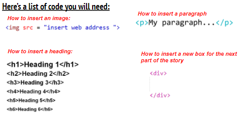
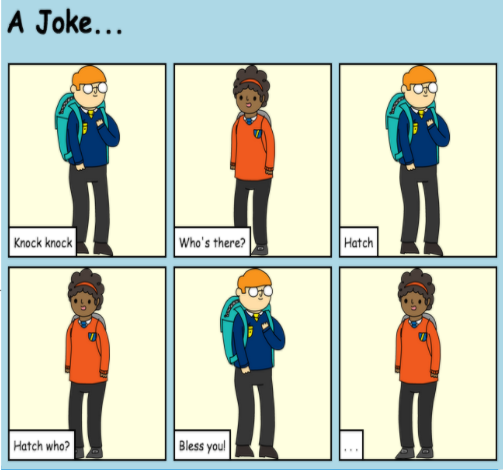

# 💻 Introduction to HTML and CSS 

You  will explore the two core languages that are used to build web pages; Hypertext Markup Language (HTML) and Cascading Style Sheets (CSS).

## ✅ Learning Outcomes: Exercise 1.3

> *By completing this exercise you will have experienced the following:*

* Using HTML div tags to group together images and paragraphs.
*	Explore additional CSS properties to see what happens when changes are made to numbers of colours. 

---

## 🎯 Exercise 1.3:  Tell A Story 

* You will be introduced to HTML div tags. Div is short of division, and is a way of grouping things together. 

*  Using the **index.html** edit the code to create your very own story, **be creative** 

🆘**Use the HTML Code to help you**

---
Your final webpage should look something like this:

# ⏭️ Next Lesson
* In the next lesson you will be introduced to more CSS properties allowing for additional customisation of your web page.